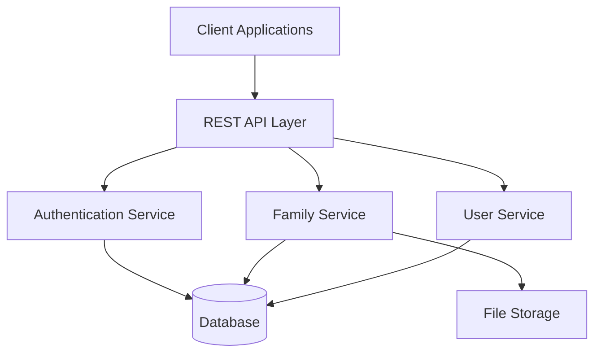
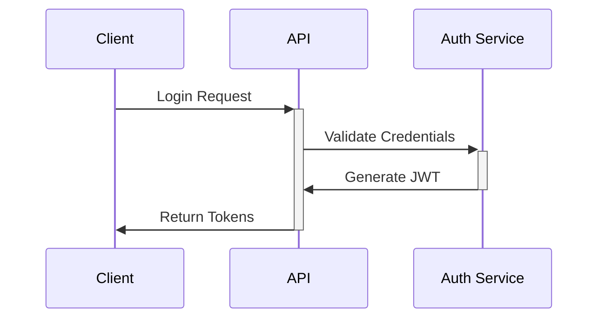
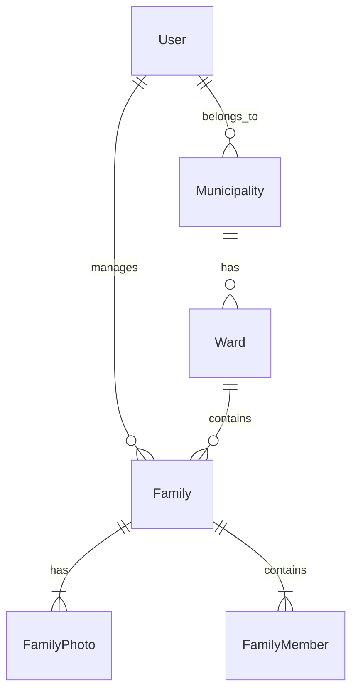
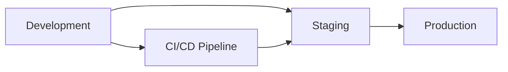
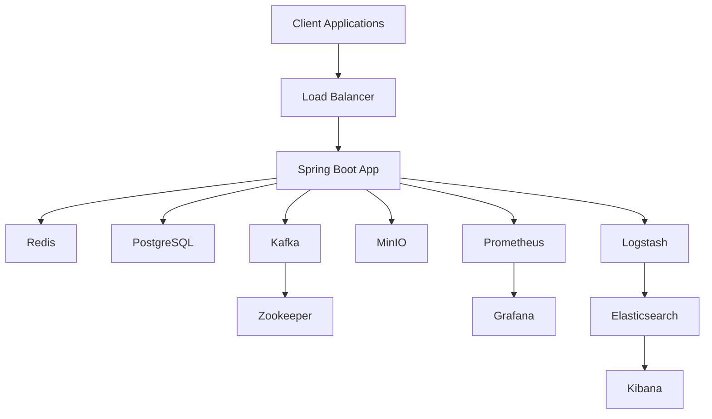

# Digital Profile Management Information System (DPMS) Documentation

## Overview

DPMS is a comprehensive digital solution designed to manage population data for municipalities in Nepal. The system enables efficient tracking, management, and analysis of family and population data while maintaining strict access controls and data security.

## Table of Contents

1. [System Architecture](#system-architecture)
2. [Technology Stack](#technology-stack)
3. [Project Structure](#project-structure)
4. [API Documentation](#api-documentation)
5. [Security Model](#security-model)
6. [Database Schema](#database-schema)
7. [Infrastructure Components](#infrastructure-components)
8. [Development Setup](#development-setup)
9. [Infrastructure Architecture](#infrastructure-architecture)

## System Architecture



## Technology Stack

- **Backend Framework**: Spring Boot (Kotlin)
- **Database**: PostgreSQL
- **Security**: JWT-based authentication
- **Documentation**: OpenAPI (Swagger)
- **Build Tool**: Gradle
- **Cache**: Redis
- **Message Broker**: Apache Kafka
- **File Storage**: MinIO
- **Monitoring**: Prometheus + Grafana
- **Logging**: ELK Stack (Elasticsearch, Logstash, Kibana)

## Infrastructure Components

### Core Services

- **PostgreSQL**: Primary database (port 5432)
- **Redis**: Caching and session management (port 6379)
- **MinIO**: S3-compatible object storage (ports 9000, 9001)
- **Kafka**: Event streaming and async processing (port 9092)
- **Zookeeper**: Kafka cluster management (port 2181)

### Monitoring Stack

- **Prometheus**: Metrics collection and storage (port 9090)
- **Grafana**: Metrics visualization and alerting (port 3000)

### Logging Stack (ELK)

- **Elasticsearch**: Log storage and search (port 9200)
- **Logstash**: Log processing pipeline
- **Kibana**: Log visualization and analysis (port 5601)

## Project Structure

```
dpms-api/
├── src/
│   └── main/
│       └── kotlin/np/gov/likhupikemun/dpms/
│           ├── auth/
│           │   ├── api/
│           │   │   ├── controller/
│           │   │   └── dto/
│           │   └── service/
│           ├── family/
│           │   ├── api/
│           │   │   ├── controller/
│           │   │   └── dto/
│           │   └── service/
│           └── shared/
│               ├── config/
│               └── dto/
```

## API Documentation

### Authentication Endpoints

| Method | Endpoint                              | Description            | Roles         |
| ------ | ------------------------------------- | ---------------------- | ------------- |
| POST   | `/api/v1/auth/register`               | Register new user      | Public        |
| POST   | `/api/v1/auth/login`                  | User login             | Public        |
| POST   | `/api/v1/auth/refresh`                | Refresh token          | Authenticated |
| POST   | `/api/v1/auth/password-reset/request` | Request password reset | Public        |
| POST   | `/api/v1/auth/password-reset/reset`   | Reset password         | Public        |

### User Management Endpoints

| Method | Endpoint                         | Description      | Roles                                  |
| ------ | -------------------------------- | ---------------- | -------------------------------------- |
| POST   | `/api/v1/users`                  | Create user      | MUNICIPALITY_ADMIN, WARD_ADMIN         |
| GET    | `/api/v1/users/search`           | Search users     | MUNICIPALITY_ADMIN, WARD_ADMIN, VIEWER |
| POST   | `/api/v1/users/{userId}/approve` | Approve user     | MUNICIPALITY_ADMIN, WARD_ADMIN         |
| DELETE | `/api/v1/users/{userId}`         | Deactivate user  | MUNICIPALITY_ADMIN, WARD_ADMIN         |
| DELETE | `/api/v1/users/{userId}/delete`  | Safe delete user | MUNICIPALITY_ADMIN, WARD_ADMIN         |

### Family Management Endpoints

| Method | Endpoint                | Description     | Roles                                               |
| ------ | ----------------------- | --------------- | --------------------------------------------------- |
| POST   | `/api/v1/families`      | Create family   | SUPER_ADMIN, MUNICIPALITY_ADMIN, WARD_ADMIN, EDITOR |
| PUT    | `/api/v1/families/{id}` | Update family   | SUPER_ADMIN, MUNICIPALITY_ADMIN, WARD_ADMIN, EDITOR |
| GET    | `/api/v1/families/{id}` | Get family      | All authenticated users                             |
| GET    | `/api/v1/families`      | Search families | All authenticated users                             |
| DELETE | `/api/v1/families/{id}` | Delete family   | SUPER_ADMIN, MUNICIPALITY_ADMIN, WARD_ADMIN, EDITOR |

### Family Photo Endpoints

| Method | Endpoint                                       | Description  | Roles                              |
| ------ | ---------------------------------------------- | ------------ | ---------------------------------- |
| POST   | `/api/v1/families/{familyId}/photos`           | Upload photo | MUNICIPALITY_ADMIN, EDITOR         |
| GET    | `/api/v1/families/{familyId}/photos/{photoId}` | Get photo    | MUNICIPALITY_ADMIN, EDITOR, VIEWER |
| GET    | `/api/v1/families/{familyId}/photos`           | List photos  | MUNICIPALITY_ADMIN, EDITOR, VIEWER |
| DELETE | `/api/v1/families/{familyId}/photos/{photoId}` | Delete photo | MUNICIPALITY_ADMIN, EDITOR         |

## Security Model

### User Roles

1. **SUPER_ADMIN**: System-wide administration
2. **MUNICIPALITY_ADMIN**: Municipality-level administration
3. **WARD_ADMIN**: Ward-level administration
4. **EDITOR**: Data entry and modification
5. **VIEWER**: Read-only access

### Authentication Flow



## Database Schema



## Requirements

### System Requirements

- JDK 17 or higher
- PostgreSQL 12 or higher
- Minimum 2GB RAM
- 20GB storage space

### Security Requirements

- TLS/SSL encryption for all communications
- Password complexity requirements
- Rate limiting for authentication endpoints
- JWT token expiration
- Role-based access control

### Performance Requirements

- Response time < 500ms for 95% of requests
- Support for concurrent users: 100+
- File upload size limit: 10MB
- API rate limiting: 100 requests per minute per user

## Deployment



## Development Setup

### Prerequisites

- Docker and Docker Compose
- JDK 17 or higher
- Gradle 8.x

### Environment Variables

```bash
# Core
SPRING_PROFILES_ACTIVE=dev
POSTGRES_DB=dpms
POSTGRES_USER=dpms
POSTGRES_PASSWORD=dpmsSecurePass123!

# Redis
REDIS_PASSWORD=redisSecurePass123!

# MinIO
MINIO_ROOT_USER=minioadmin
MINIO_ROOT_PASSWORD=miniopass
```

### Running Locally

1. Start infrastructure services:

```bash
docker-compose up -d
```

2. Build and run the application:

```bash
./gradlew bootRun
```

### Resource Allocations

#### Application

- CPU: 1-2 cores
- Memory: 1-2GB

#### Database

- Memory: 4GB

#### Monitoring & Logging

- Elasticsearch: 2GB
- Other services: Default allocations

## Infrastructure Architecture



For more detailed information about specific components, please refer to the respective documentation sections in the `/docs` directory.
